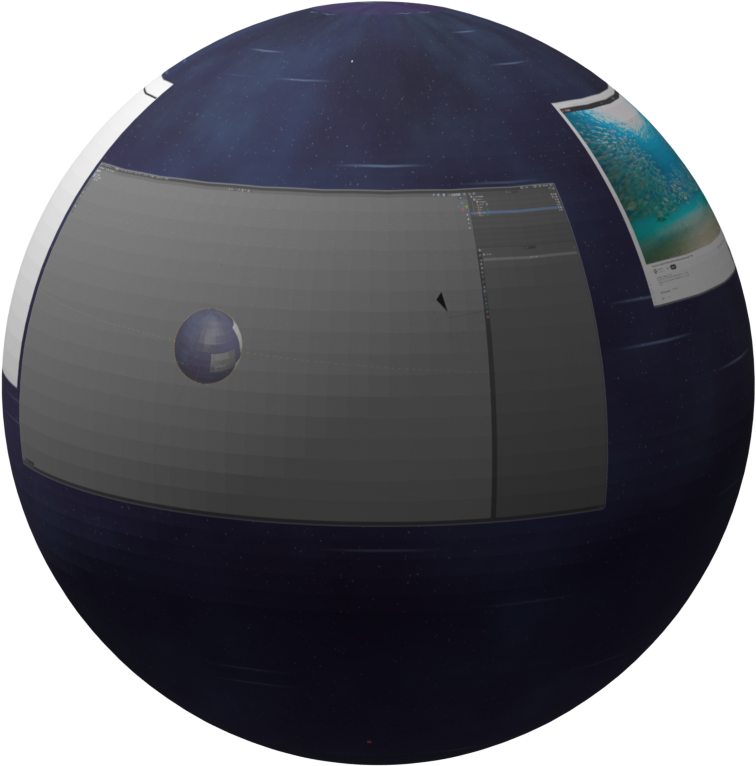

<div align="center">


# Nourish



<br><br>

[](https://github.com/y5-snowies/nourish/actions/workflows/ci.yml)
[](https://github.com/y5-snowies/nourish/releases)
[](#license)

### Simple, next generation operating system

https://github.com/user-attachments/assets/03d78832-c451-451f-a701-713710a20051

**[nourish.snowies.com](https://nourish.snowies.com)**  ·  [Guide](https://nourish.snowies.com/guide)  ·  [Discord](https://discord.gg/kasec5bYb)

</div>

---
Nourish is a Linux desktop that doesn't limit you to your screen size.
 
It's free and open source, and stable enough to be a daily driver. It collects
no data whatsoever — no telemetry, no analytics, not even crash reports. Nothing
ever leaves your machine.
 
It's performant, and renders using Vulkan. Optionally, you can set an automatic
fallback or explicitly select GLES on systems where Vulkan is not supported.
 
It fully supports NVIDIA and cards that use Mesa drivers such as Intel and AMD.

## Features
 
- A viewport you can zoom and pan, giving you an effectively infinite amount of
  space to work on.
- Built on the Wayland protocol with fractional-scale support, so compliant
  windows stay sharp at any zoom level instead of turning blurry.
- Non-intrusive multitasking aids that make it easy to work ergonomically across
  many contexts at once.
- Carefully designed for stability, with attention to avoiding faults and
  performance issues.
Visit **[nourish.snowies.com](https://nourish.snowies.com)** to see what it looks
like and the full list of features.

## Install

On Fedora 44, it's one command. You get a prebuilt build, so there's no toolchain to set up:

```bash
curl -fsSL https://nourish.snowies.com/release/latest/fedora44/package.tar.gz | tar -xz && y5-install/install.sh
```

The installer is interactive and safe to re-run. For the full walkthrough see
[`https://nourish.snowies.com/guide.html`](https://nourish.snowies.com/guide.html).

Prefer a pinned build? Every release is also published immutably under its version —
`https://nourish.snowies.com/release/v1.0.0/fedora44/package.tar.gz` — while `latest`
always points at the newest. Browse them on the
[releases page](https://github.com/y5-snowies/nourish/releases).

For any other distribution, please see [`https://nourish.snowies.com/guide.html`](https://nourish.snowies.com/guide.html) I currently do not publish individual binaries for different distributions and generally recommend using Fedora.
If you are using a different distribution, it is easy to build from source which will link against your distribution system libraries versions automatically. 

## Source
 
Under the hood the engine is called **`y5`** — a Wayland compositor written in
Rust, standing on patched forks of
[smithay](https://github.com/Smithay/smithay) (Wayland),
[bevy](https://bevyengine.org) + [wgpu](https://wgpu.rs) (rendering), and
[iced](https://iced.rs) (interface), all kept in-tree under `vendor/`.
 
A thorough guide is available [here](https://nourish.snowies.com/guide.html).
 
> **Note:** y5 was architected and hand-written, and only later enhanced with AI.
> It contains a lot of generated code, all of which was pre-directed and reviewed
> carefully.
 
```bash
# Build & run nested in your current Wayland session
environment/run-host.sh winit release
 
# Build the binary for use
environment/build-release.sh system
```
 
If you get errors about missing libraries, these are system libraries that the
project links against. On Fedora you can install them with
`environment/install-deps.sh`. On another distribution, feed that script to your
AI agent and ask which equivalent packages it needs.


## Contributing
 
Contributions are welcome! If you hit a bug or have an idea, please
[open an issue](https://github.com/y5-snowies/nourish/issues) — bug reports and
feature requests are genuinely appreciated. Pull requests are welcome too.

## License

Licensed under either of [Apache License 2.0](LICENSE-APACHE) or
[MIT license](LICENSE-MIT) at your option.
